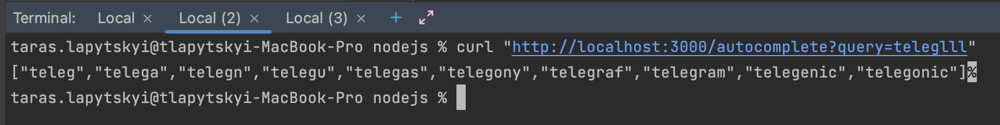

###  Run docker:
`docker compose up`
###  Run script to seed English words:
`docker exec -it app node upload_words.js `
###  Request words:
`curl "http://localhost:3000/autocomplete?query=abalien"`

