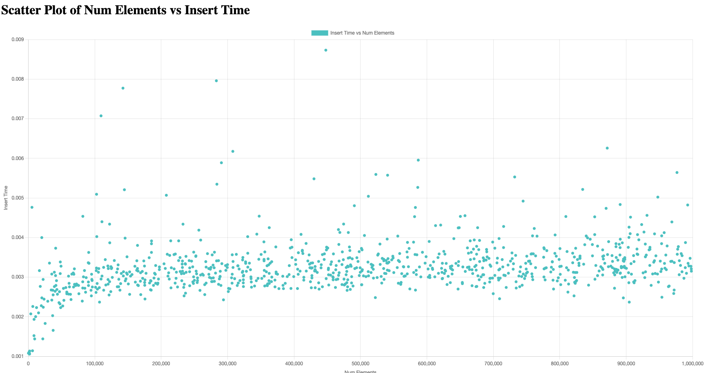

# AVL Tree

# Counting Sort Limitations

Counting Sort doesn't perform well in the following scenarios:

## 1. Large Range of Values (Large Max - Min)
**Problem:** When the range of input values (i.e., the difference between the maximum and minimum values) is very large, the size of the counting array increases significantly.

**Impact:** The algorithm's space complexity becomes problematic because the count array needs to store every integer within the range, even if many values are not present in the input array.

**Example:** Sorting an array with values ranging from `1` to `1,000,000` would require a count array of size `1,000,000`. If most of these numbers are missing from the array, a lot of unnecessary space is wasted.

---

## 2. Non-Integer Data
**Problem:** Counting Sort is typically used for sorting integers. While it can be adapted for other types of data (like floats or strings), the algorithm becomes inefficient or even unusable when working with such data types.

**Impact:** For non-integer types like floating-point numbers, strings, or other complex data types, mapping each distinct value to a count index becomes more difficult, reducing the effectiveness of Counting Sort.

---

## 3. Sparse Data
**Problem:** If the input array contains only a few unique values, but those values span a wide range, the count array will be very large, and a significant amount of memory will be wasted.

**Impact:** The performance degrades in terms of both time and space, as the algorithm essentially works by allocating space for every potential number in the range, even if many numbers are not used in the input.

